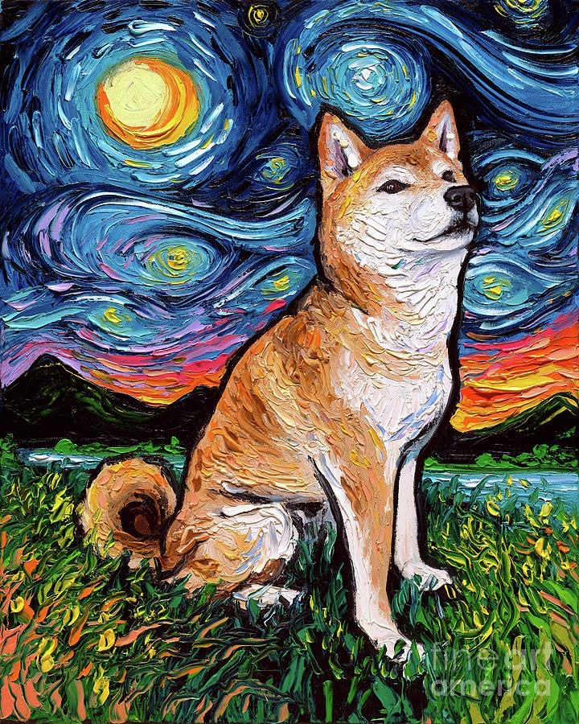

# 챗도지 - 전문 운세 상담 서비스



## 📋 프로젝트 개요

챗도지는 AI 기반의 전문 운세 상담 서비스입니다. 사용자의 생년월일과 출생시간을 바탕으로 개인 맞춤 운세를 제공합니다.

## ✨ 주요 기능

### 무료 기능

- 일일 5회 무료 운세 상담
- 기본 운세 분석 (종합운, 애정운, 직업운, 건강운)
- 빠른 질문 기능
- 대화형 인터페이스

### 프리미엄 기능 (출시 예정)

- 무제한 운세 상담
- 상세한 사주 분석
- 개인 맞춤 조언
- 광고 없는 이용
- 운세 히스토리 저장

## 🛠 기술 스택

### Backend

- Node.js + Express.js
- OpenAI GPT API
- Serverless Framework
- CORS, Rate Limiting

### Frontend

- Vanilla JavaScript
- CSS3 (Flexbox, Grid)
- 반응형 디자인
- Progressive Web App 지원

### 배포

- Frontend: Cloudflare Pages
- Backend: AWS Lambda (Serverless)

## 🚀 로컬 개발 환경 설정

### 1. 환경 변수 설정

```bash
# backend/.env 파일 생성
OPENAI_API_KEY=your_openai_api_key
PORT=3000
NODE_ENV=development
```

### 2. 백엔드 실행

```bash
cd backend
npm install
npm run dev
```

### 3. 프론트엔드 실행

프론트엔드는 정적 파일이므로 Live Server나 로컬 웹서버로 실행:

```bash
cd frontend
# Live Server 확장으로 index.html 실행
# 또는 Python으로: python -m http.server 8000
```

## 💰 수익화 전략

### 1. 프리미엄 구독 모델

- **기본 요금제**: 무료 (일일 5회 제한)
- **프리미엄**: 월 9,900원
  - 무제한 상담
  - 상세 분석
  - 광고 없음
  - 히스토리 저장

### 2. 광고 수익

- 카카오 AdFit 광고
- 구글 애드센스
- 네이티브 광고

### 3. 추가 서비스

- 1:1 전문가 상담 연결
- 맞춤형 부적/악세서리 판매
- 운세 리포트 PDF 다운로드

## 📊 사용자 경험 개선 사항

### 1. 성능 최적화

- API 응답 시간 최적화
- 이미지 최적화
- 캐싱 전략 구현

### 2. 보안 강화

- Rate Limiting 적용
- 입력 검증 및 필터링
- HTTPS 적용

### 3. 사용자 인터페이스

- 반응형 디자인
- 다크 모드 지원
- 접근성 개선

## 🔧 추후 개발 계획

### Phase 1 (현재)

- [x] 기본 운세 상담 기능
- [x] 프론트엔드 UI/UX 개선
- [x] 백엔드 API 최적화
- [x] Rate limiting 구현

### Phase 2 (다음 단계)

- [ ] 사용자 회원가입/로그인
- [ ] 결제 시스템 연동 (Stripe/Toss)
- [ ] 프리미엄 기능 구현
- [ ] 데이터베이스 연동

### Phase 3 (향후)

- [ ] 모바일 앱 개발
- [ ] AI 모델 자체 학습
- [ ] 다국어 지원
- [ ] 소셜 기능 (운세 공유)

## 📈 마케팅 전략

### 1. SEO 최적화

- 메타 태그 최적화
- 구조화된 데이터
- 사이트맵 생성

### 2. 소셜 미디어

- 인스타그램 콘텐츠
- 유튜브 운세 컨텐츠
- 틱톡 바이럴 영상

### 3. 콘텐츠 마케팅

- 운세 블로그 운영
- 주간/월간 운세 리포트
- 이메일 뉴스레터

## 🎯 수익 목표

### 단기 목표 (3개월)

- 일일 활성 사용자 100명
- 월 매출 100만원
- 프리미엄 전환율 5%

### 중기 목표 (6개월)

- 일일 활성 사용자 500명
- 월 매출 500만원
- 모바일 앱 출시

### 장기 목표 (1년)

- 일일 활성 사용자 2,000명
- 월 매출 2,000만원
- 전문가 네트워크 구축

## 📝 라이선스

MIT License

## 📞 문의

- 이메일: contact@chatdoge.com
- 카카오톡: @챗도지
- 인스타그램: @chatdoge_official
